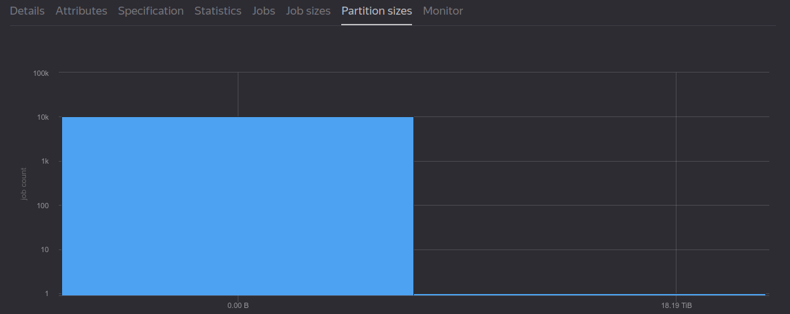
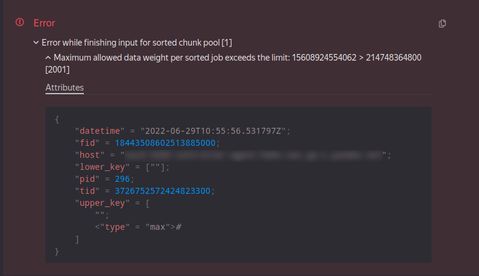

---
metadata:
  - name: generator
    content: Diplodoc Platform v5.5.3
csp:
  - script-src-elem:
      - https://mc.yandex.ru
  - connect-src:
      - https://*.algolia.net
      - https://*.algolianet.com
vcsPath: ru/yql/faq/errors.md
sourcePath: ru/yql/faq/errors.md
---
# Ошибки

## Expected comparable type, but got: Yson
Такое может произойти, если таблица создана в YTsaurus без схемы, а затем отсортирована. При этом система (YT) в схеме таблицы устанавливает столбцу, по которому производилась сортировка, тип `any`, что в терминах YQL эквивалентно типу столбца `Yson` (произвольные YSON-данные).

Например, для запроса
``` yql
SELECT * FROM my_table
WHERE key = 'www.youtube.com/watch?v=Xn599R0ZBwg';
```
...можно сделать workaround:
``` yql
SELECT * FROM my_table
WHERE Yson::ConvertToString(Yson::Parse(key)) = 'www.youtube.com/watch?v=Xn599R0ZBwg';
```
**Недостаток этого решения:**
Запросы из примеров выводят все строки, которые соответствуют какому-то ключу. Если таблица по этому ключу отсортирована, то обычно время работы такого запроса не зависит от объема таблицы. Но для обсуждаемого здесь workaround такая оптимизация не сработает, и придётся прочитать всю таблицу.



Для <!--[корректно схематизированных](../misc/schema.md)--> корректно схематизированных таблиц такой проблемы нет, и если у вас есть такая возможность, — настройте схему или попросите это сделать ответственных за нужные вам таблицы.



Подробнее [про Yson UDF](../udf/list/yson.md).

## Cannot add type String (String?) and String (String?)
Ошибка возникает при попытке конкатенации строк с помощью оператора '+'.
Вместо него следует использовать оператор '||':
``` yql
SELECT "Hello, " || "world" || "!";
```

## Expression has to be an aggregation function or key column, because aggregation is used elsewhere in this subquery
Наиболее частой причиной возникновения проблемы является использование алиасов из `SELECT` в конструкции `HAVING`. Алиасы — названия полей, которые следуют за `AS` в `SELECT`, они являются проекцией и выполняются уже после `HAVING`, поэтому там их использовать невозможно.

Пример некорректного запроса (так работать **НЕ** будет):
``` yql
USE <cluster-name>;
SELECT
    region,
    COUNT(age) AS counter
FROM `home/yql/tutorial/users`
GROUP BY region
HAVING counter > 3
```

Для того чтобы избежать дублирование вызова агрегатных функций, рекомендуется использование подзапроса с переносом логики из `HAVING` в `WHERE`:

``` yql
USE <cluster-name>;
SELECT *
FROM
    (SELECT
        region,
        COUNT(age) AS counter
    FROM `home/yql/tutorial/users`
    GROUP BY region)
WHERE counter > 3
```

## Value type "double" is not a number
Вероятной причиной появления ошибки, как правило, является деление на ноль, что приводит к значению NaN (Not a number), которое пока не поддерживается в ряде случаев YTsaurus.

## Row weight is too large
Причиной ошибки является превышение максимального размера памяти, выделяемого для строки. Для изменения этого ограничения стоит использовать соответствующую настройку ([PRAGMA](../syntax/pragma/yt.md#yt)), которая позволяет увеличить ограничение на максимальную длину строки таблицы в YTsaurus.
Значение по умолчанию — "16M", максимальное значение — "128M". В случае превышения максимального значения необходимо менять логику вычислений, например, разделить таблицу на несколько частей или применить алгоритмы сжатия ([Compress UDF](../udf/list/compress_decompress.md)).
``` yql
PRAGMA yt.MaxRowWeight = "32M";
```

## Key weight is too large
Возникает при слишком большом размере значения в ключевом поле таблицы. Одним из способов решения проблемы является использование настройки ([PRAGMA](../syntax/pragma/yt.md#yt)), которая позволяет увеличить ограничение на максимальную длину ключевых полей таблицы в YTsaurus, где поле используется для `ORDER BY`, `GROUP BY`, `PARTITION BY`, `DISTINCT`, `REDUCE`.

Значение по умолчанию — "16K", максимальное значение — "256K".
``` yql
PRAGMA yt.MaxKeyWeight = "32K";
```
## Таблица содержит разнотипные значения в одной колонке {#badtabledata}

При обработке таких таблиц могут возникать разные ошибки, в зависимости от настроек запроса:
* ``` ReadYsonValue(): requirement cmd == Int64Marker failed, message: Expected char: "\2", but read: "\1"```
* ``` { 'Table input pipe failed' { 'Unexpected type of "score" column, expected: "int64" found "uint64"' } }```

Чтобы прочитать или обработать такую таблицу, нужно пропатчить тип колонки на `Yson?` через [WITH COLUMNS](../syntax/select/with.md) и дальше вручную разобрать данные с использованием [Yson UDF](../udf/list/yson.md):
``` yql
SELECT Yson::ConvertToDouble(bad_column, Yson::Options(false as Strict)) ?? CAST(Yson::ConvertToString(bad_column, Yson::Options(false as Strict)) as Double) as bad_column
FROM `path/to/bad_table`
WITH COLUMNS Struct<bad_column: Yson?>;
```

Если типы допускают автоконвертирование, то можно так:
``` yql
SELECT Yson::ConvertToDouble(bad_column, Yson::Options(true as AutoConvert)) as bad_column
FROM `path/to/bad_table`
WITH COLUMNS Struct<bad_column: Yson?>;
```

## Access denied for user <>: "read" permission for node <> is not allowed by any matching ACE {#symlinkaccess}

### Запрос прав в YTsaurus

Нужно проверить, открывается ли таблица в интерфейсе YTsaurus. Если прав нет, их следует запросить через веб-нитерфейс YTsaurus или через CLI.

### Права на Symlink таблицы

Если в YTsaurus интерфейсе таблица открывается, но YQL ее не видит, то проблема может быть в symlink-ах на таблицы, когда у пользователя есть права доступа на нижележащую таблицу, но нет доступа на чтение самого symlink. Для резолвинга нижележащей таблицы в YTsaurus не требуются права на чтение symlink, поэтому в YTsaurus содержимое отображается нормально. Но YQL помимо резолвинга еще читает атрибуты symlink-а, потому что в атрибутах может переопределяться, например, схема таблицы. Для решения данной проблемы необходимо запросить права на чтение symlink.

## Maximum allowed data weight per sorted job exceeds the limit {#key_monster}

В большинстве случаев ошибка возникает при исполнении `JOIN`, если в его входах есть ключ-монстр (очень много записей с одним и тем же значением ключа). Диагностировать наличие ключа-монстра можно, перейдя на соответствующую операцию YTsaurus, кликнув на красный кружок в плане исполнения запроса. Далее в интерфейсе YTsaurus необходимо открыть вкладку `Partition sizes` упавшей операции:



Если есть крупные партиции (больше 200Gb), то это сигнализирует о наличии ключей-монстров. Само значение проблемного ключа, как правило, можно узнать, раскрыв сообщение об ошибке на вкладке `Details` операции:



В данном примере проблемный ключ это пустая строка. <!--Другие способы узнать проблемные ключи описаны в разделе [Производительность](performance.md).-->

Основной способ решения данной проблемы &mdash; это фильтрация проблемных значений ключа на входах JOIN. Как правило, ключи-монстры содержат нерелевантные значения (NULL, пустая строка), которые безболезненно можно отфильтровать. Если значения ключей-монстров важны, то их можно обработать отдельно.

Помимо JOIN, такая ошибка может возникать еще в следующих случаях:
1. Очень большой объем данных в `GROUP BY`, `JOIN`. Решение: нужно попытаться уменьшить объем.
2. В [окно](../syntax/window) попала вся таблица целиком. Решение: пересмотреть условия партицирования оконной функции
3. Для каких-то значений ключа `GROUP BY` получилось слишком много данных. Диагностика проблемного ключа здесь такая же, как и для `JOIN`. Решение: отфильтровать проблемный ключ, добавить дополнительные колонки в ключ группировки.

## Reading multiple times from the same source is not supported
DQ не может исполнить запрос, так как в построенном плане присутствует раздвоение входного потока данных на несколько. На данный момент в YTsaurus такое поведение не поддерживается, и корректно выполнить этот запрос не получится.

<!--## Too large table(s) for evaluation pass: NNN > 1048576 {#eval_error}

См. описание [этапов исполнения запроса](../misc/exec_steps.md)-->

## Strict Yson type is not allowed to write, please use Optional<Yson>

Это текущее ограничение YTsaurus, которое не позволяет писать в режиме `type_v3` неопциональные Yson колонки. Ошибка возникает при использовании в запросе прагмы [yt.UseNativeYtTypes](../syntax/pragma/yt.md#yt-usenativeyttypes) &mdash; обратите внимание, эта прагма включена по умолчанию.

Чтобы избавиться от ошибки:
- Убедитесь, что запрос не формирует явно данные с типом Yson на любом уровне (например, тип `List<Yson>` также невозможно записать).
- Убедитесь, что в используемых таблицах запроса нет колонок с неопциональным Yson на любом уровне.
- Некоторые агрегатные функции (`AGG_LIST`, например) безусловно снимают опциональность со своих элементов. Поэтому, даже если исходная колонка имела тип `Optional<Yson>`, то в результате `AGG_LIST` получается тип `List<Yson>`, который невозможно записать. В этом случае необходимо преобразовать тип колонки в любой другой тип перед `AGG_LIST`.
- Также можно отключить прагму `PRAGMA yt.UseNativeYtTypes`. Следует иметь в виду, что при отключении прагмы вы потеряете преимущества строгой типизации, так как нативные типы будут представлены как строки.

